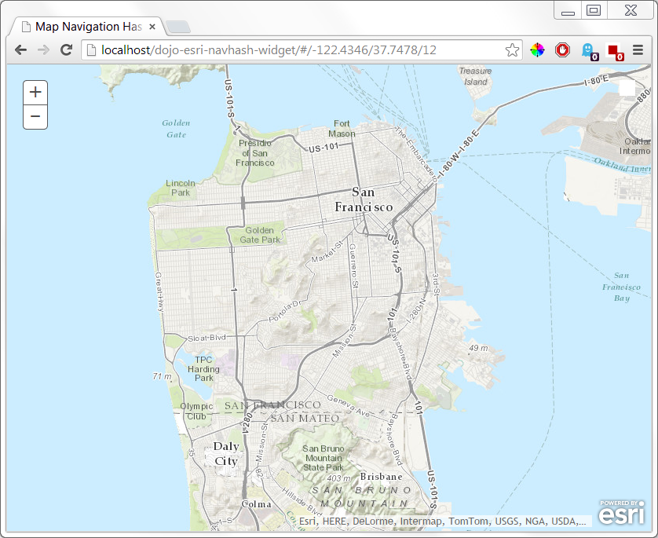

Map Navigation Hash (History)
======================

#### Overview
Uses dojo/router to enable zooming to next or previous extent using the browser forward and back buttons. The geographic map center and map zoom level is placed on the url.

#### Configuration
Include the following code in js/config/viewer.js:
```javascript
var navHash = new NavHash({
	map: this.map, //reference to the jsapi map object
}, "referenceNode");
navHash.startup();
```

#### Usage Example
appurl.com/index.htlm#/_longitude_/_latitude_/_zoomLevel_

The application will automatically update the url hash on pan and zoom. Users may also manually edit the route to go to a specific long, lat, and zoom level. A user can bookmark the url in the browser and, on load, the app will zoom and pan to the bookmarked location.

[Click for demo](http://brianbunker.github.io/dojo-esri-navhash-widget)

Screen from Sample page:


